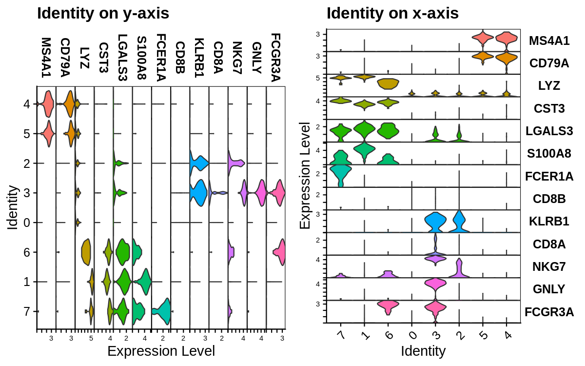
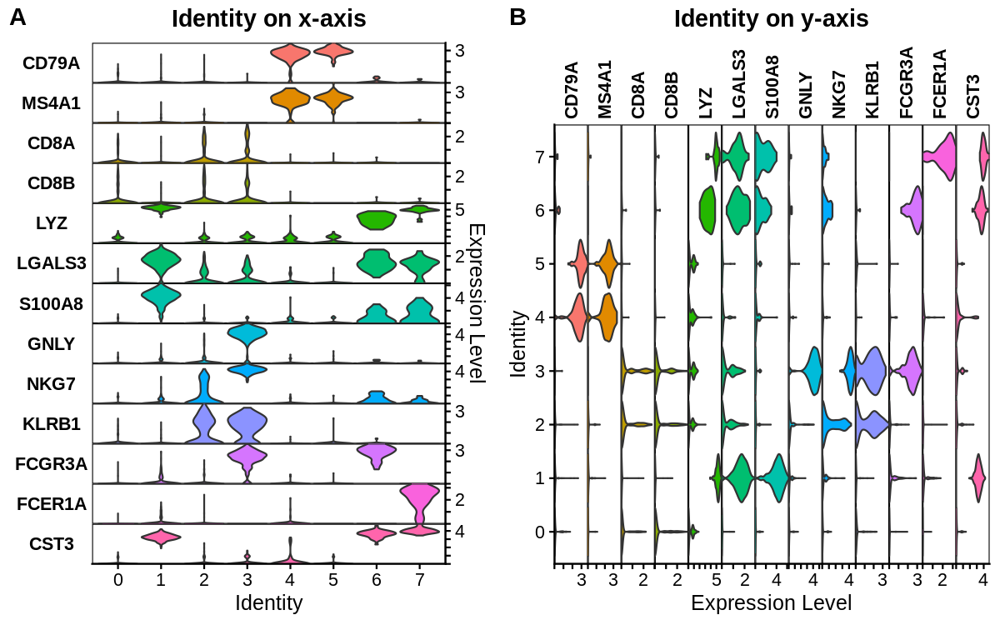
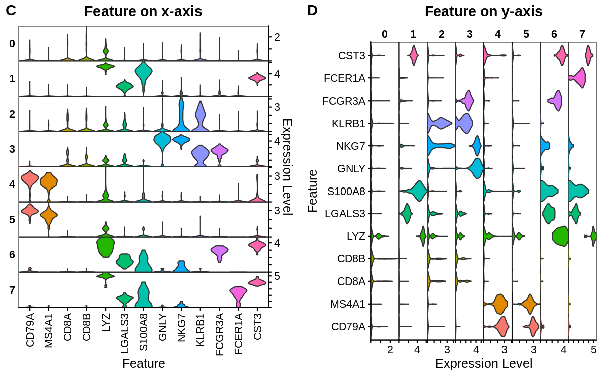
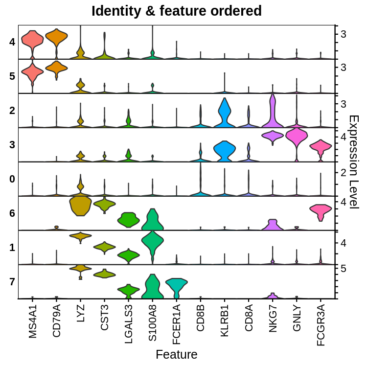
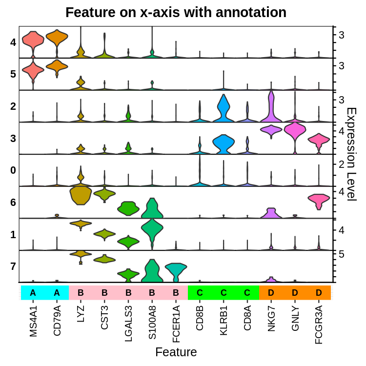
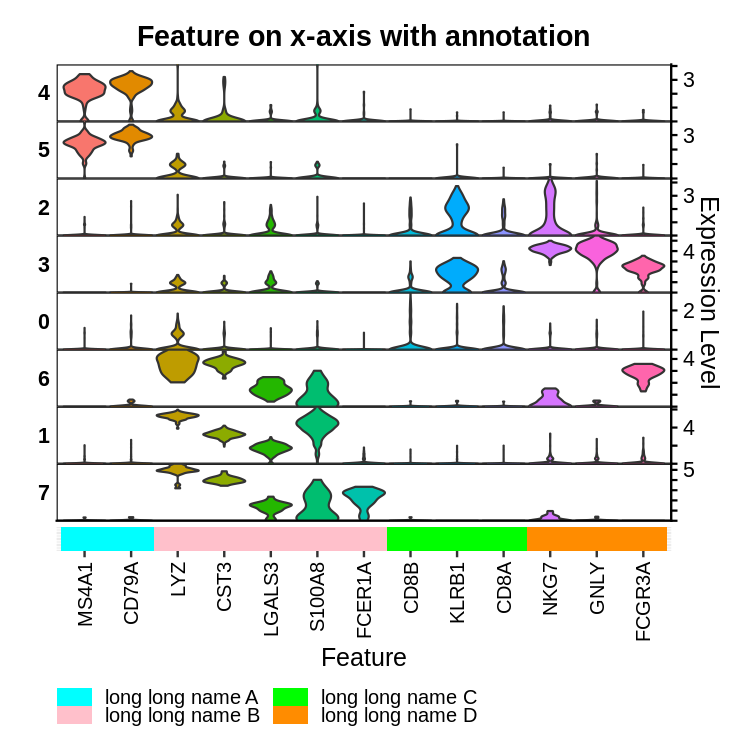
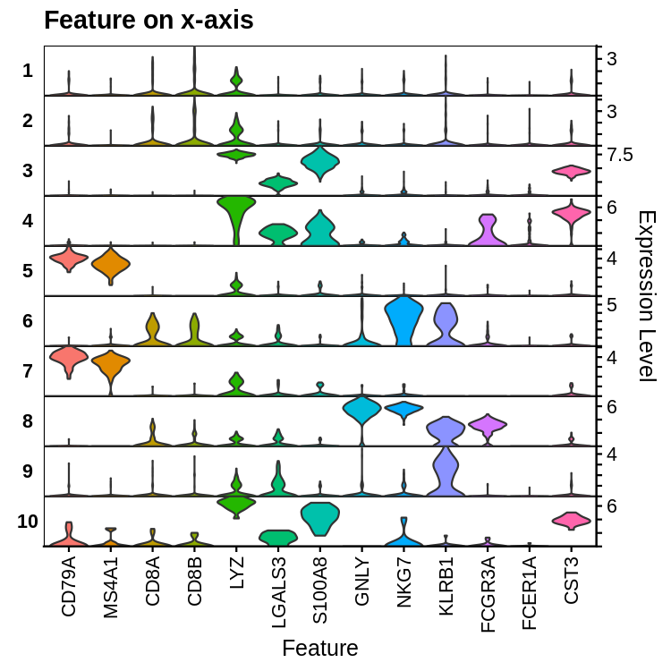

StackedVlnPlot
==============

Demo data
---------

The PMBC scRNA-seq demo data (`*.rds`) files are available in the `data`
folder of this repository.

With `VlnPlot` and a `Seurat` object
------------------------------------

Stacked violin plot functionality using the `VlnPlot` function is added
to `Seurat` in version 3.2.1.

``` r
library(Seurat)
library(ggplot2)
library(cowplot)

# Load Seurat obj
pbmc <- readRDS("data/pbmc_2k_v3_Seurat.rds")

features <- c("CD79A", "MS4A1", "CD8A", "CD8B", "LYZ", "LGALS3", "S100A8", "GNLY",
              "NKG7", "KLRB1", "FCGR3A", "FCER1A", "CST3")

a <- VlnPlot(pbmc, features, stack = TRUE, sort = TRUE) +
        theme(legend.position = "none") + ggtitle("Identity on y-axis")

b <- VlnPlot(pbmc, features, stack = TRUE, sort = TRUE, flip = TRUE) +
        theme(legend.position = "none") + ggtitle("Identity on x-axis")
```

``` r
# Use plot_grid to join plots
plot_grid(a, b)
```



With `ggplot2` and a `data.frame` object
----------------------------------------

Given a `data.frame` object and a vector of identity classes (cluster
ID), a stacked violin plot can be created with the `ggplot2` package.

### Prepare `data.frame`

``` r
# Load data.frame obj
pbmc <- readRDS("data/pbmc_2k_v3_df.rds")
identity <- readRDS("data/pbmc_2k_v3_Seurat_Idents.rds")

features <- c("CD79A", "MS4A1", "CD8A", "CD8B", "LYZ", "LGALS3", "S100A8", "GNLY",
              "NKG7", "KLRB1", "FCGR3A", "FCER1A", "CST3")

# Subset data.frame
pbmc <- pbmc[,features]

# Add cell ID and identity classes
pbmc$Cell <- rownames(pbmc)
pbmc$Idents <- identity

# Use melt to change data.frame format
pbmc <- reshape2::melt(pbmc, id.vars = c("Cell","Idents"), measure.vars = features,
                       variable.name = "Feat", value.name = "Expr")
head(pbmc, 10)
```

    ##                  Cell Idents  Feat     Expr
    ## 1  AACAACCTCACCTCTG-1      0 CD79A 0.000000
    ## 2  AGGAGGTTCGCGGACT-1      0 CD79A 1.743733
    ## 3  AGGCATTCAAGACGGT-1      1 CD79A 0.000000
    ## 4  GCAACCGCAGTTTCGA-1      1 CD79A 0.000000
    ## 5  TTTCACATCGTCCTCA-1      1 CD79A 0.000000
    ## 6  CTGCCTAAGCGTTCAT-1      1 CD79A 0.000000
    ## 7  CCTCCTCAGCGTCAGA-1      5 CD79A 3.104723
    ## 8  AACCATGAGAGCCTGA-1      0 CD79A 0.000000
    ## 9  ATGAGTCTCACATTGG-1      2 CD79A 0.000000
    ## 10 AGTCATGCACTAACCA-1      4 CD79A 2.756005

### Create plots

There are different ways to show the stacked violin plot:

| Plot | X-axis     | Y-axis     | Facet    |
|------|------------|------------|----------|
| a    | Identity   | Expression | Feature  |
| b    | Expression | Identity   | Feature  |
| c    | Feature    | Expression | Identity |
| d    | Expression | Feature    | Identity |

#### Identity on x-axis (A) or y-axis (B)

``` r
# Identity on x-axis
a <- ggplot(pbmc, aes(factor(Idents), Expr, fill = Feat)) +
        geom_violin(scale = "width", adjust = 1, trim = TRUE) +
        scale_y_continuous(expand = c(0, 0), position="right", labels = function(x)
                           c(rep(x = "", times = length(x)-2), x[length(x) - 1], "")) +
        facet_grid(rows = vars(Feat), scales = "free", switch = "y") +
        theme_cowplot(font_size = 12) +
        theme(legend.position = "none", panel.spacing = unit(0, "lines"),
          plot.title = element_text(hjust = 0.5),
              panel.background = element_rect(fill = NA, color = "black"),
              strip.background = element_blank(),
              strip.text = element_text(face = "bold"),
              strip.text.y.left = element_text(angle = 0)) +
        ggtitle("Identity on x-axis") + xlab("Identity") + ylab("Expression Level")

# Identity on y-axis
b <- ggplot(pbmc, aes(Expr, factor(Idents), fill = Feat)) +
        geom_violin(scale = "width", adjust = 1, trim = TRUE) +
        scale_x_continuous(expand = c(0, 0), labels = function(x)
                           c(rep(x = "", times = length(x)-2), x[length(x) - 1], "")) +
        facet_grid(cols = vars(Feat), scales = "free")  +
        theme_cowplot(font_size = 12) +
        theme(legend.position = "none", panel.spacing = unit(0, "lines"),
          plot.title = element_text(hjust = 0.5),
              panel.background = element_rect(fill = NA, color = "black"),
              strip.background = element_blank(),
              strip.text = element_text(face = "bold"),
              strip.text.x.top = element_text(angle = 90, hjust = 0, vjust = 0.5)) +
        ggtitle("Identity on y-axis") + xlab("Expression Level") + ylab("Identity")
```

``` r
# Use plot_grid to join plots
plot_grid(a, b, labels = c("A","B"))
```



#### Features on x-axis (C) or y-axis (D)

``` r
# Features on x-axis
c <- ggplot(pbmc, aes(factor(Feat), Expr, fill = Feat)) +
        geom_violin(scale = "width", adjust = 1, trim = TRUE) +
        scale_y_continuous(expand = c(0, 0), position="right", labels = function(x)
                           c(rep(x = "", times = length(x)-2), x[length(x) - 1], "")) +
        facet_grid(rows = vars(Idents), scales = "free", switch = "y") +
        theme_cowplot(font_size = 12) +
        theme(legend.position = "none", panel.spacing = unit(0, "lines"),
          plot.title = element_text(hjust = 0.5),
              panel.background = element_rect(fill = NA, color = "black"),
              strip.background = element_blank(),
              strip.text = element_text(face = "bold"),
              strip.text.y.left = element_text(angle = 0),
              axis.text.x = element_text(angle = 90, hjust = 1, vjust = 0.5)) +
        ggtitle("Feature on x-axis") + xlab("Feature") + ylab("Expression Level")

# Features on y-axis
d <- ggplot(pbmc, aes(Expr, factor(Feat), fill = Feat)) +
        geom_violin(scale = "width", adjust = 1, trim = TRUE) +
        scale_x_continuous(expand = c(0, 0), labels = function(x)
                           c(rep(x = "", times = length(x)-2), x[length(x) - 1], "")) +
        facet_grid(cols = vars(Idents), scales = "free") +
        theme_cowplot(font_size = 12) +
        theme(legend.position = "none", panel.spacing = unit(0, "lines"),
          plot.title = element_text(hjust = 0.5),
              panel.background = element_rect(fill = NA, color = "black"),
              strip.background = element_blank(),
              strip.text = element_text(face = "bold")) +
        ggtitle("Feature on y-axis") + xlab("Expression Level") + ylab("Feature")
```

``` r
# Use plot_grid to join plots
plot_grid(c, d, labels = c("C","D"))
```



### Sort identity classes and features

> **Note:** Some of the codes below are taken and modified from the
> `Seurat` package.

Below demonstrates how to recreate the reordering of the identity
classes and features seen in Seurat’s stacked violin plots.

``` r
# Calculate average expression per Idents, output as wide format
avg <- sapply(X = split(x = pbmc, f = pbmc$Idents),
              FUN = function(df) { return(tapply(X = df$Expr, INDEX = df$Feat, FUN = mean)) })

# L2Norm (Euclidean norm) function
L2Norm <- function(mat, MARGIN){
        normalized <- sweep(x = mat, MARGIN = MARGIN,
                            STATS = apply(X = mat, MARGIN = MARGIN,
                                          FUN = function(x){ sqrt(x = sum(x ^ 2)) }), FUN = "/")
        normalized[!is.finite(x = normalized)] <- 0
        return(normalized)
}

# Performs hierarchical clustering
idents.order <- hclust(d = dist(t(L2Norm(mat = avg, MARGIN = 2))))$order
avg <- avg[,idents.order]
avg <- L2Norm(mat = avg, MARGIN = 1)
mat <- hclust(d = dist(avg))$merge

# Order feature clusters by position of their "rank-1 idents"
position <- apply(X = avg, MARGIN = 1, FUN = which.max)
orderings <- list()
for (i in 1:nrow(mat)) {
        x <- if (mat[i,1] < 0) -mat[i,1] else orderings[[mat[i,1]]]
        y <- if (mat[i,2] < 0) -mat[i,2] else orderings[[mat[i,2]]]
        x.pos <- min(x = position[x])
        y.pos <- min(x = position[y])
        orderings[[i]] <- if (x.pos < y.pos) { c(x, y) } else { c(y, x) }
}
features.order <- orderings[[length(orderings)]]

# Update Feature and Identity factor orders
pbmc$Idents <- factor(pbmc$Idents, levels = levels(pbmc$Idents)[idents.order])
pbmc$Feat <- factor(pbmc$Feat, levels = levels(pbmc$Feat)[features.order])

# Plot stacked violin plot with reordered identity classes and features
e <- ggplot(pbmc, aes(factor(Feat), Expr, fill = Feat)) +
        geom_violin(scale = "width", adjust = 1, trim = TRUE) +
        scale_y_continuous(expand = c(0, 0), position="right", labels = function(x)
                           c(rep(x = "", times = length(x)-2), x[length(x) - 1], "")) +
        facet_grid(rows = vars(Idents), scales = "free", switch = "y") +
        theme_cowplot(font_size = 12) +
        theme(legend.position = "none", panel.spacing = unit(0, "lines"),
          plot.title = element_text(hjust = 0.5),
              panel.background = element_rect(fill = NA, color = "black"),
              strip.background = element_blank(),
              strip.text = element_text(face = "bold"),
              strip.text.y.left = element_text(angle = 0),
              axis.text.x = element_text(angle = 90, hjust = 1, vjust = 0.5)) +
        ggtitle("Identity & feature ordered") + xlab("Feature") + ylab("Expression Level")
```

``` r
e
```



### Add gene grouping annotation

Below demonstrates how to add gene grouping annotation to sorted stacked
violin plots.

``` r
# Create grouping info
df <- data.frame(x = levels(pbmc$Feat), group = c("A","A","B","B","B","B","B","C","C","C","D","D","D"), 
                 stringsAsFactors = FALSE)
df$x <- factor(df$x, levels = levels(pbmc$Feat))
df$group <- factor(df$group)
df
```

    ##         x group
    ## 1   MS4A1     A
    ## 2   CD79A     A
    ## 3     LYZ     B
    ## 4    CST3     B
    ## 5  LGALS3     B
    ## 6  S100A8     B
    ## 7  FCER1A     B
    ## 8    CD8B     C
    ## 9   KLRB1     C
    ## 10   CD8A     C
    ## 11   NKG7     D
    ## 12   GNLY     D
    ## 13 FCGR3A     D

|   x    | group |
|:------:|:-----:|
| MS4A1  |   A   |
| CD79A  |   A   |
| LGALS3 |   B   |
|  LYZ   |   B   |
|  CST3  |   B   |
| S100A8 |   B   |
| FCER1A |   B   |
| KLRB1  |   C   |
|  CD8B  |   C   |
|  CD8A  |   C   |
|  NKG7  |   D   |
|  GNLY  |   D   |
| FCGR3A |   D   |

``` r
color <- c("cyan", "pink", "green", "darkorange")

# Same as plot e, but hide x-axis labels, change plot.margin to reduce spacing between plots
f <- ggplot(pbmc, aes(Feat, Expr, fill = Feat)) +
        geom_violin(scale = "width", adjust = 1, trim = TRUE) +
        scale_y_continuous(expand = c(0, 0), position="right", labels = function(x)
                           c(rep(x = "", times = length(x)-2), x[length(x) - 1], "")) +
        facet_grid(rows = vars(Idents), scales = "free", switch = "y") +
        theme_cowplot(font_size = 12) +
        theme(legend.position = "none", panel.spacing = unit(0, "lines"),
          plot.title = element_text(hjust = 0.5),
              panel.background = element_rect(fill = NA, color = "black"),
              plot.margin = margin(7, 7, 0, 7, "pt"),
              strip.background = element_blank(),
              strip.text = element_text(face = "bold"),
              strip.text.y.left = element_text(angle = 0),
              axis.title.x = element_blank(),
              axis.ticks.x = element_blank(),
              axis.text.x = element_blank()) +
        ggtitle("Feature on x-axis with annotation") + ylab("Expression Level")

# Use geom_tile() to add grouping colorings and geom_text() to add grouping labels
g <- ggplot(df, aes(x = x, y = 1, fill = group, label = group)) + geom_tile() +
        geom_text(fontface = "bold", size = 3) + theme_bw(base_size = 12) +
        scale_fill_manual(values = color) + scale_y_continuous(expand = c(0, 0)) +
        theme(legend.position = "none", panel.spacing = unit(0, "lines"),
              panel.background = element_blank(), 
              panel.border = element_blank(),
              plot.background = element_blank(), 
              plot.margin = margin(0, 7, 7, 7, "pt"),
              axis.text.x = element_text(angle = 90, hjust = 1, vjust = 0.5, color = "black"),
              axis.title.y = element_blank(),
              axis.ticks.y = element_blank(),
              axis.text.y = element_blank()) + xlab("Feature")
```

``` r
# Use plot_grid to join plots
plot_grid(f, g, ncol = 1, rel_heights = c(0.78, 0.22), align = "v", axis = "lr")
```



Legend is used to defind the grouping labels when the labels are too
long to fit within the annotation bar.

``` r
# Change to long names
levels(df$group) = c("long long name A", "long long name B", "long long name C", "long long name D")

# guides() is used to specify some aesthetic parameters of legend key
h <- ggplot(df, aes(x = x, y = 1, fill = group)) + geom_tile() + theme_bw(base_size = 12) +
        scale_fill_manual(values = color) + scale_y_continuous(expand = c(0, 0)) +
        guides(fill = guide_legend(direction = "vertical", label.position = "right",
                             title.theme = element_blank(), keyheight = 0.5, nrow = 2)) +
        theme(legend.position = "bottom",
              legend.justification = "left",
              legend.margin = margin(0,0,0,0),
              legend.box.margin = margin(-10,5,0,0),
              panel.spacing = unit(0, "lines"),
              panel.background = element_blank(),
              panel.border = element_blank(),
              plot.background = element_blank(),
              plot.margin = margin(0, 7, 7, 7, "pt"),
              axis.text.x = element_text(angle = 90, hjust = 1, vjust = 0.5, color = "black"),
              axis.title.y = element_blank(),
              axis.ticks.y = element_blank(),
              axis.text.y = element_blank()) + xlab("Feature")
```

``` r
# Use plot_grid to join plots
plot_grid(f, h, ncol = 1, rel_heights = c(0.78, 0.22), align = "v", axis = "lr")
```



With `ggplot2` and a `SingleCellExperiment` object
--------------------------------------------------

The expression and cluster information can be extracted from the
*processed* `SingleCellExperiment` object to create a stacked violin
plot with the `ggplot2` package.

The `SingleCellExperiment` object provided in this repository contains
both raw and normalised counts. The cluster assignments are stored in
the `colData`.

``` r
library(scater)

# Load sce obj
sce <- readRDS("data/pbmc_2k_v3_sce.rds")
sce
```

    ## class: SingleCellExperiment 
    ## dim: 18791 1779 
    ## metadata(1): Samples
    ## assays(2): counts logcounts
    ## rownames(18791): AL627309.1 AL627309.3 ... AL354822.1 AC240274.1
    ## rowData names(6): ID Symbol ... detected n_cells
    ## colnames(1779): AACAACCTCACCTCTG-1 AGGAGGTTCGCGGACT-1 ... AATGGAACAGTAGGAC-1
    ##   CCCAACTTCTCGAGTA-1
    ## colData names(10): Sample Barcode ... sizeFactor label
    ## reducedDimNames(3): PCA TSNE UMAP
    ## mainExpName: NULL
    ## altExpNames(0):

Store the required information from the `sce` object in a `data.frame`,
and create a stacked violin plot as described above for a `data.frame`
object.

``` r
features <- c("CD79A", "MS4A1", "CD8A", "CD8B", "LYZ", "LGALS3", "S100A8", "GNLY",
              "NKG7", "KLRB1", "FCGR3A", "FCER1A", "CST3")

# Subset dgCMatrix
pbmc <- assay(sce, "logcounts")[features,]

# Transpose and convert to data.frame
pbmc <- as.data.frame(t(as.matrix(pbmc)))

# Add cell ID and identity classes
pbmc$Cell <- rownames(pbmc)
pbmc$Cluster <- sce$label

# Use melt to change data.frame format
pbmc <- reshape2::melt(pbmc, id.vars = c("Cell","Cluster"), measure.vars = features,
                       variable.name = "Feat", value.name = "Expr")

i <- ggplot(pbmc, aes(factor(Feat), Expr, fill = Feat)) +
        geom_violin(scale = "width", adjust = 1, trim = TRUE) +
        scale_y_continuous(expand = c(0, 0), position="right", labels = function(x)
                           c(rep(x = "", times = length(x)-2), x[length(x) - 1], "")) +
        facet_grid(rows = vars(Cluster), scales = "free", switch = "y") +
        theme_cowplot(font_size = 12) +
        theme(legend.position = "none", panel.spacing = unit(0, "lines"),
              panel.background = element_rect(fill = NA, color = "black"),
              strip.background = element_blank(),
              strip.text = element_text(face = "bold"),
              strip.text.y.left = element_text(angle = 0),
              axis.text.x = element_text(angle = 90, hjust = 1, vjust = 0.5)) +
        ggtitle("Feature on x-axis") + xlab("Feature") + ylab("Expression Level")
```

``` r
i
```



Session Info
------------

``` r
sessionInfo()
```

<details>
<summary>
Click to expand
</summary>

    ## R version 4.1.2 (2021-11-01)
    ## Platform: x86_64-conda-linux-gnu (64-bit)
    ## Running under: Ubuntu 20.04.4 LTS
    ## 
    ## Matrix products: default
    ## BLAS/LAPACK: /home/ihsuan/miniconda3/envs/jupyterlab/lib/libopenblasp-r0.3.18.so
    ## 
    ## locale:
    ##  [1] LC_CTYPE=en_GB.UTF-8       LC_NUMERIC=C               LC_TIME=en_GB.UTF-8       
    ##  [4] LC_COLLATE=en_GB.UTF-8     LC_MONETARY=en_GB.UTF-8    LC_MESSAGES=en_GB.UTF-8   
    ##  [7] LC_PAPER=en_GB.UTF-8       LC_NAME=C                  LC_ADDRESS=C              
    ## [10] LC_TELEPHONE=C             LC_MEASUREMENT=en_GB.UTF-8 LC_IDENTIFICATION=C       
    ## 
    ## attached base packages:
    ## [1] stats4    stats     graphics  grDevices utils     datasets  methods   base     
    ## 
    ## other attached packages:
    ##  [1] HDF5Array_1.22.1            rhdf5_2.38.0                DelayedArray_0.20.0        
    ##  [4] Matrix_1.4-0                scater_1.22.0               scuttle_1.4.0              
    ##  [7] SingleCellExperiment_1.16.0 SummarizedExperiment_1.24.0 Biobase_2.54.0             
    ## [10] GenomicRanges_1.46.1        GenomeInfoDb_1.30.1         IRanges_2.28.0             
    ## [13] S4Vectors_0.32.3            BiocGenerics_0.40.0         MatrixGenerics_1.6.0       
    ## [16] matrixStats_0.61.0          patchwork_1.1.1             cowplot_1.1.1              
    ## [19] ggplot2_3.3.5               SeuratObject_4.0.4          Seurat_4.1.0               
    ## [22] knitr_1.37                 
    ## 
    ## loaded via a namespace (and not attached):
    ##   [1] plyr_1.8.6                igraph_1.2.11             lazyeval_0.2.2           
    ##   [4] splines_4.1.2             BiocParallel_1.28.3       listenv_0.8.0            
    ##   [7] scattermore_0.8           digest_0.6.29             htmltools_0.5.2          
    ##  [10] viridis_0.6.2             fansi_1.0.2               magrittr_2.0.2           
    ##  [13] ScaledMatrix_1.2.0        tensor_1.5                cluster_2.1.2            
    ##  [16] ROCR_1.0-11               globals_0.14.0            spatstat.sparse_2.1-0    
    ##  [19] colorspace_2.0-3          ggrepel_0.9.1             xfun_0.29                
    ##  [22] dplyr_1.0.8               crayon_1.5.0              RCurl_1.98-1.6           
    ##  [25] jsonlite_1.8.0            spatstat.data_2.1-2       survival_3.2-13          
    ##  [28] zoo_1.8-9                 glue_1.6.2                polyclip_1.10-0          
    ##  [31] gtable_0.3.0              zlibbioc_1.40.0           XVector_0.34.0           
    ##  [34] leiden_0.3.9              BiocSingular_1.10.0       Rhdf5lib_1.16.0          
    ##  [37] future.apply_1.8.1        abind_1.4-5               scales_1.1.1             
    ##  [40] DBI_1.1.2                 spatstat.random_2.1-0     miniUI_0.1.1.1           
    ##  [43] Rcpp_1.0.8                viridisLite_0.4.0         xtable_1.8-4             
    ##  [46] reticulate_1.24           spatstat.core_2.4-0       rsvd_1.0.5               
    ##  [49] htmlwidgets_1.5.4         httr_1.4.2                RColorBrewer_1.1-2       
    ##  [52] ellipsis_0.3.2            ica_1.0-2                 pkgconfig_2.0.3          
    ##  [55] farver_2.1.0              uwot_0.1.11               deldir_1.0-6             
    ##  [58] utf8_1.2.2                tidyselect_1.1.2          labeling_0.4.2           
    ##  [61] rlang_1.0.1               reshape2_1.4.4            later_1.3.0              
    ##  [64] munsell_0.5.0             tools_4.1.2               cli_3.2.0                
    ##  [67] generics_0.1.2            ggridges_0.5.3            evaluate_0.15            
    ##  [70] stringr_1.4.0             fastmap_1.1.0             goftest_1.2-3            
    ##  [73] fitdistrplus_1.1-6        purrr_0.3.4               RANN_2.6.1               
    ##  [76] pbapply_1.5-0             future_1.24.0             nlme_3.1-155             
    ##  [79] sparseMatrixStats_1.6.0   mime_0.12                 compiler_4.1.2           
    ##  [82] beeswarm_0.4.0            plotly_4.10.0             png_0.1-7                
    ##  [85] spatstat.utils_2.3-0      tibble_3.1.6              stringi_1.7.6            
    ##  [88] highr_0.9                 lattice_0.20-45           vctrs_0.3.8              
    ##  [91] rhdf5filters_1.6.0        pillar_1.7.0              lifecycle_1.0.1          
    ##  [94] spatstat.geom_2.3-2       lmtest_0.9-39             RcppAnnoy_0.0.19         
    ##  [97] BiocNeighbors_1.12.0      data.table_1.14.2         bitops_1.0-7             
    ## [100] irlba_2.3.5               httpuv_1.6.5              R6_2.5.1                 
    ## [103] promises_1.2.0.1          KernSmooth_2.23-20        gridExtra_2.3            
    ## [106] vipor_0.4.5               parallelly_1.30.0         codetools_0.2-18         
    ## [109] MASS_7.3-55               assertthat_0.2.1          withr_2.4.3              
    ## [112] sctransform_0.3.3         GenomeInfoDbData_1.2.7    mgcv_1.8-39              
    ## [115] parallel_4.1.2            grid_4.1.2                rpart_4.1.16             
    ## [118] beachmat_2.10.0           tidyr_1.2.0               rmarkdown_2.11           
    ## [121] DelayedMatrixStats_1.16.0 Rtsne_0.15                shiny_1.7.1              
    ## [124] ggbeeswarm_0.6.0

</details>
