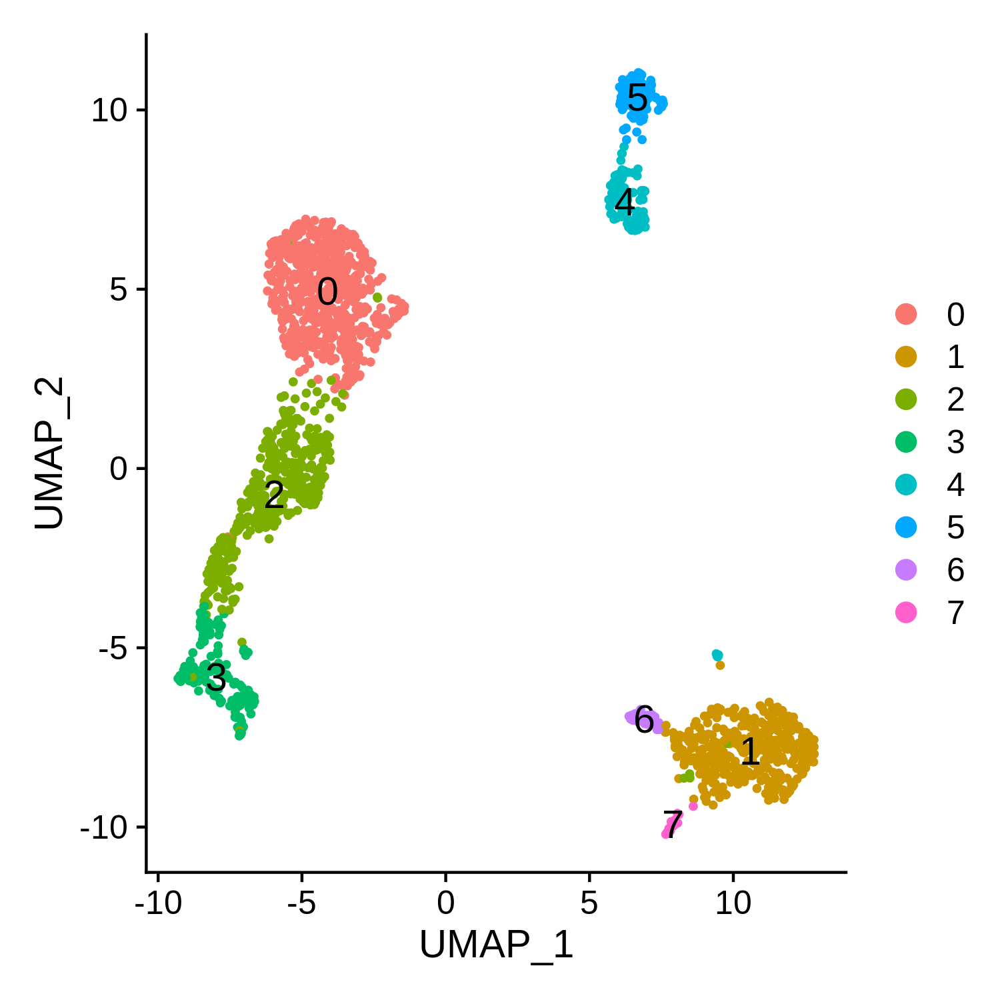
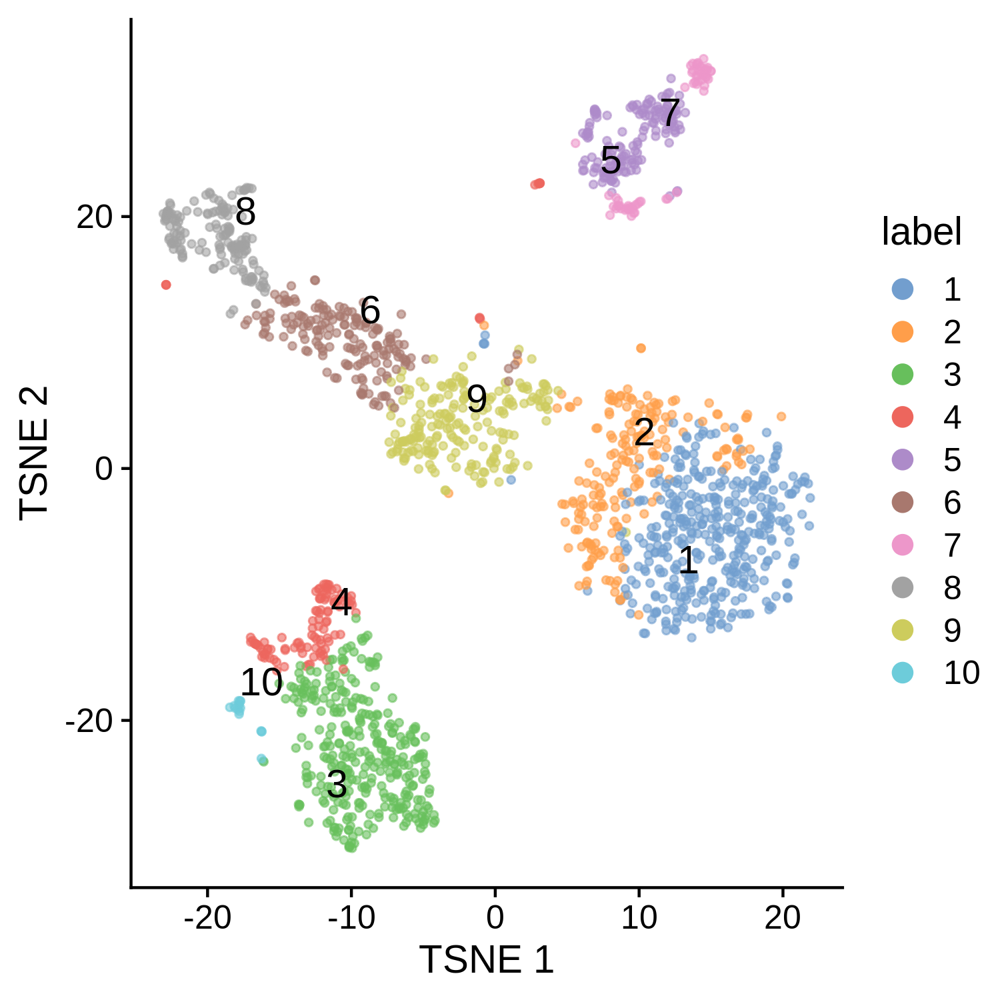

5k_pbmc_v3
==========

About the dataset
-----------------

The **5k Peripheral blood mononuclear cells (PBMCs) from a healthy donor
(v3 chemistry)** dataset is a single cell gene expression dataset
retreived from the [10X Genomics
website](https://support.10xgenomics.com/single-cell-gene-expression/datasets/3.0.2/5k_pbmc_v3).

Download the “Feature / cell matrix HDF5 (filtered)” output file from
the website.

About the R objects
-------------------

The downloaded HDF5 file is processed in R (including downsampled to
2000 cells), and the resulting R objects are write to files:

-   `pbmc_2k_v3_Seurat.rds` - A `Seurat` object of the pbmc dataset
-   `pbmc_2k_v3_Seurat_Idents.rds` - A factor object containing the
    cluster assignments (saved from Seurat workflow)
-   `pbmc_2k_v3_df.rds` - A `data.frame` object containing the
    normalised expression (saved from Seurat workflow)
-   `pbmc_2k_v3_sce.rds` - A `SingleCellExperiment` object of the pbmc
    dataset (saved from scater/scran workflow)

Creating the R objects - Seurat
-------------------------------

### Setup the Seurat Objects

``` r
library(Seurat)

# Load the PBMC dataset
pbmc.data <- Read10X_h5("5k_pbmc_v3_filtered_feature_bc_matrix.h5", use.names = TRUE, unique.features = TRUE)

# Create Seurat object
pbmc <- CreateSeuratObject(counts = pbmc.data, project = "pbmc5k", min.cells = 3, min.features = 200)
pbmc
```

    ## An object of class Seurat 
    ## 18791 features across 4962 samples within 1 assay 
    ## Active assay: RNA (18791 features, 0 variable features)

``` r
# Downsampling to 2000 cells to reduce file size
set.seed(12345)
cells.to.keep <- sample(Cells(pbmc), 2000)
pbmc <- subset(pbmc, cells = cells.to.keep)
pbmc
```

    ## An object of class Seurat 
    ## 18791 features across 2000 samples within 1 assay 
    ## Active assay: RNA (18791 features, 0 variable features)

### QC and selecting cells for further analysis

``` r
# Add percentage of reads that map to the mitochondrial genome
pbmc[["percent.mito"]] <- PercentageFeatureSet(pbmc, pattern = "^MT-")

# We filter cells that have unique feature counts over 5,000 or less than 500
# We filter cells that have >15% mitochondrial counts
pbmc <- subset(pbmc, subset = nFeature_RNA > 500 & nFeature_RNA < 5000 & percent.mito < 15)
pbmc
```

    ## An object of class Seurat 
    ## 18791 features across 1779 samples within 1 assay 
    ## Active assay: RNA (18791 features, 0 variable features)

### Normalizing the data

``` r
pbmc <- NormalizeData(pbmc, normalization.method = "LogNormalize", scale.factor = 10000)
```

### Identification of highly variable features

``` r
# We return 2,000 features per dataset
pbmc <- FindVariableFeatures(pbmc, selection.method = "vst", nfeatures = 2000)
```

### Scaling the data

``` r
all.genes <- rownames(pbmc)

# Scales and centers features
pbmc <- ScaleData(pbmc, features = all.genes)
```

### Perform linear dimensional reduction

``` r
pbmc <- RunPCA(pbmc, features = VariableFeatures(object = pbmc), seed.use = 12345, verbose = FALSE)
pbmc
```

    ## An object of class Seurat 
    ## 18791 features across 1779 samples within 1 assay 
    ## Active assay: RNA (18791 features, 2000 variable features)
    ##  1 dimensional reduction calculated: pca

### Cluster the cells

``` r
# Constructs a Shared Nearest Neighbor (SNN) Graph
set.seed(12345)
pbmc <- FindNeighbors(pbmc, reduction = "pca", dims = 1:20)

# Identify clusters of cells by a shared nearest neighbor (SNN) modularity optimization based clustering algorithm
pbmc <- FindClusters(pbmc, resolution = 0.5, random.seed = 12345)
```

    ## Modularity Optimizer version 1.3.0 by Ludo Waltman and Nees Jan van Eck
    ## 
    ## Number of nodes: 1779
    ## Number of edges: 65866
    ## 
    ## Running Louvain algorithm...
    ## Maximum modularity in 10 random starts: 0.8823
    ## Number of communities: 8
    ## Elapsed time: 0 seconds

### Run non-linear dimensional reduction

``` r
pbmc <- RunUMAP(pbmc, dims = 1:20)
pbmc <- RunTSNE(pbmc, dims = 1:20)
pbmc
```

    ## An object of class Seurat 
    ## 18791 features across 1779 samples within 1 assay 
    ## Active assay: RNA (18791 features, 2000 variable features)
    ##  3 dimensional reductions calculated: pca, umap, tsne

``` r
DimPlot(pbmc, reduction = "umap", label = TRUE, label.size = 5)
```



``` r
DimPlot(pbmc, reduction = "tsne", label = TRUE, label.size = 5)
```


### Save objects

``` r
# Save pbmc obj, without the scale.data slot
saveRDS(DietSeurat(pbmc, dimreducs = Reductions(pbmc), graphs = Graphs(pbmc)), 
    "pbmc_2k_v3_Seurat.rds")

# Get object's identity classes
identity <- Idents(pbmc)

# Save identity obj
saveRDS(identity, "pbmc_2k_v3_Seurat_Idents.rds")
```

Creating the R objects - `data.frame`
-------------------------------------

Continues from above.

``` r
# Save expression as data.frame
pbmcNorm <- FetchData(pbmc, all.genes, slot = "data")

# Save pbmcNorm obj
saveRDS(pbmcNorm, "pbmc_2k_v3_df.rds")
```

Creating the R objects - `scater/scran`
---------------------------------------

### Setup the SingleCellExperiment Objects

``` r
library(scater)
library(scran)
library(bluster)

# Load the PBMC dataset
sce <- DropletUtils::read10xCounts("5k_pbmc_v3_filtered_feature_bc_matrix.h5", sample.names = "pbmc5k")

# Add barcode ID to column names and gene name to row names
colnames(sce) <- colData(sce)$Barcode
rownames(sce) <- rowData(sce)$Symbol

sce
```

    ## class: SingleCellExperiment 
    ## dim: 33538 5025 
    ## metadata(1): Samples
    ## assays(1): counts
    ## rownames(33538): MIR1302-2HG FAM138A ... AC213203.1 FAM231C
    ## rowData names(3): ID Symbol Type
    ## colnames(5025): AAACCCAAGCGTATGG-1 AAACCCAGTCCTACAA-1 ... TTTGTTGTCCTTGGAA-1
    ##   TTTGTTGTCGCACGAC-1
    ## colData names(2): Sample Barcode
    ## reducedDimNames(0):
    ## mainExpName: NULL
    ## altExpNames(0):

### QC and selecting cells for further analysis

``` r
# Compute and add QC metrics
is.mito <- grep("^MT-", rowData(sce)$Symbol)
sce <- addPerCellQC(sce, list(MT = is.mito))
sce <- addPerFeatureQC(sce)
rowData(sce)$n_cells <- rowData(sce)$detected/100 * ncol(sce)

# Obtain identical genes & cells as the starting Seurat object by using same fileter parameters:
# min.cells = 3, min.features = 200
sce <- sce[rowData(sce)$n_cells >= 3, colData(sce)$detected >= 200]
sce
```

    ## class: SingleCellExperiment 
    ## dim: 18791 4962 
    ## metadata(1): Samples
    ## assays(1): counts
    ## rownames(18791): AL627309.1 AL627309.3 ... AL354822.1 AC240274.1
    ## rowData names(6): ID Symbol ... detected n_cells
    ## colnames(4962): AAACCCAAGCGTATGG-1 AAACCCAGTCCTACAA-1 ... TTTGTTGTCCTTGGAA-1
    ##   TTTGTTGTCGCACGAC-1
    ## colData names(8): Sample Barcode ... subsets_MT_percent total
    ## reducedDimNames(0):
    ## mainExpName: NULL
    ## altExpNames(0):

``` r
# Downsampling to 2000 cells to reduce file size
set.seed(12345)
sce <- sce[,sample(colnames(sce), 2000)]

# Subset data using same parameters as the Seurat object
sce <- subset(sce, , detected > 500 & detected < 5000 & subsets_MT_percent < 15)
sce
```

    ## class: SingleCellExperiment 
    ## dim: 18791 1779 
    ## metadata(1): Samples
    ## assays(1): counts
    ## rownames(18791): AL627309.1 AL627309.3 ... AL354822.1 AC240274.1
    ## rowData names(6): ID Symbol ... detected n_cells
    ## colnames(1779): AACAACCTCACCTCTG-1 AGGAGGTTCGCGGACT-1 ... AATGGAACAGTAGGAC-1
    ##   CCCAACTTCTCGAGTA-1
    ## colData names(8): Sample Barcode ... subsets_MT_percent total
    ## reducedDimNames(0):
    ## mainExpName: NULL
    ## altExpNames(0):

### Normalization by deconvolution

``` r
set.seed(12345)
clusters <- quickCluster(sce, min.size = 100)
sce <- computeSumFactors(sce, cluster = clusters)
sce <- logNormCounts(sce, size_factors = sizeFactors(sce))
```

### Identification of highly variable features

``` r
# Variance modelling
dec <- modelGeneVar(sce)

# Select the top 2000 genes with the highest biological components
hvg <- getTopHVGs(stats = dec, n = 2000)
```

### Performing PCA only on the chosen HVGs

``` r
set.seed(12345)
sce <- runPCA(sce, subset_row = hvg)
sce
```

    ## class: SingleCellExperiment 
    ## dim: 18791 1779 
    ## metadata(1): Samples
    ## assays(2): counts logcounts
    ## rownames(18791): AL627309.1 AL627309.3 ... AL354822.1 AC240274.1
    ## rowData names(6): ID Symbol ... detected n_cells
    ## colnames(1779): AACAACCTCACCTCTG-1 AGGAGGTTCGCGGACT-1 ... AATGGAACAGTAGGAC-1
    ##   CCCAACTTCTCGAGTA-1
    ## colData names(9): Sample Barcode ... total sizeFactor
    ## reducedDimNames(1): PCA
    ## mainExpName: NULL
    ## altExpNames(0):

### Cluster the cells

``` r
g <- clusterRows(reducedDim(sce, "PCA")[, seq_len(20), drop = FALSE], 
         NNGraphParam(cluster.fun = "louvain", k = 10, type = "jaccard"), full = TRUE)

# Add cluster assignments to sce
colLabels(sce) <- factor(g$clusters)
```

### Run non-linear dimensional reduction

``` r
sce <- runTSNE(sce, dimred = "PCA", n_dimred = 20, perplexity = 50)
sce <- runUMAP(sce, dimred = "PCA", n_dimred = 20, n_neighbors = 30, spread = 1, min_dist = 0.3)
sce
```

    ## class: SingleCellExperiment 
    ## dim: 18791 1779 
    ## metadata(1): Samples
    ## assays(2): counts logcounts
    ## rownames(18791): AL627309.1 AL627309.3 ... AL354822.1 AC240274.1
    ## rowData names(6): ID Symbol ... detected n_cells
    ## colnames(1779): AACAACCTCACCTCTG-1 AGGAGGTTCGCGGACT-1 ... AATGGAACAGTAGGAC-1
    ##   CCCAACTTCTCGAGTA-1
    ## colData names(10): Sample Barcode ... sizeFactor label
    ## reducedDimNames(3): PCA TSNE UMAP
    ## mainExpName: NULL
    ## altExpNames(0):

``` r
plotReducedDim(sce, "UMAP", colour_by = "label", text_by = "label", point_size = 1) + 
    guides(color = guide_legend(override.aes = list(size = 3, alpha = 1))) +
    cowplot::theme_cowplot()
```


``` r
plotReducedDim(sce, "TSNE", colour_by = "label", text_by = "label", point_size = 1) +
    guides(color = guide_legend(override.aes = list(size = 3, alpha = 1))) +
    cowplot::theme_cowplot()
```



### Save objects

``` r
# Save sce obj
saveRDS(sce, "pbmc_2k_v3_sce.rds")
```

Session Info
------------

``` r
sessionInfo()
```

<details>
<summary>
Click to expand
</summary>

    ## R version 4.1.2 (2021-11-01)
    ## Platform: x86_64-conda-linux-gnu (64-bit)
    ## Running under: Ubuntu 20.04.4 LTS
    ## 
    ## Matrix products: default
    ## BLAS/LAPACK: /home/ihsuan/miniconda3/envs/jupyterlab/lib/libopenblasp-r0.3.18.so
    ## 
    ## locale:
    ##  [1] LC_CTYPE=en_GB.UTF-8       LC_NUMERIC=C               LC_TIME=en_GB.UTF-8       
    ##  [4] LC_COLLATE=en_GB.UTF-8     LC_MONETARY=en_GB.UTF-8    LC_MESSAGES=en_GB.UTF-8   
    ##  [7] LC_PAPER=en_GB.UTF-8       LC_NAME=C                  LC_ADDRESS=C              
    ## [10] LC_TELEPHONE=C             LC_MEASUREMENT=en_GB.UTF-8 LC_IDENTIFICATION=C       
    ## 
    ## attached base packages:
    ## [1] stats4    stats     graphics  grDevices utils     datasets  methods   base     
    ## 
    ## other attached packages:
    ##  [1] bluster_1.4.0               scran_1.22.1                scater_1.22.0              
    ##  [4] ggplot2_3.3.5               scuttle_1.4.0               SingleCellExperiment_1.16.0
    ##  [7] SummarizedExperiment_1.24.0 Biobase_2.54.0              GenomicRanges_1.46.1       
    ## [10] GenomeInfoDb_1.30.1         IRanges_2.28.0              S4Vectors_0.32.3           
    ## [13] BiocGenerics_0.40.0         MatrixGenerics_1.6.0        matrixStats_0.61.0         
    ## [16] SeuratObject_4.0.4          Seurat_4.1.0                knitr_1.37                 
    ## 
    ## loaded via a namespace (and not attached):
    ##   [1] plyr_1.8.6                igraph_1.2.11             lazyeval_0.2.2           
    ##   [4] splines_4.1.2             BiocParallel_1.28.3       listenv_0.8.0            
    ##   [7] scattermore_0.8           digest_0.6.29             htmltools_0.5.2          
    ##  [10] viridis_0.6.2             fansi_1.0.2               magrittr_2.0.2           
    ##  [13] ScaledMatrix_1.2.0        tensor_1.5                cluster_2.1.2            
    ##  [16] ROCR_1.0-11               limma_3.50.1              globals_0.14.0           
    ##  [19] R.utils_2.11.0            spatstat.sparse_2.1-0     colorspace_2.0-3         
    ##  [22] ggrepel_0.9.1             xfun_0.29                 dplyr_1.0.8              
    ##  [25] crayon_1.5.0              RCurl_1.98-1.6            jsonlite_1.8.0           
    ##  [28] spatstat.data_2.1-2       survival_3.2-13           zoo_1.8-9                
    ##  [31] glue_1.6.2                polyclip_1.10-0           gtable_0.3.0             
    ##  [34] zlibbioc_1.40.0           XVector_0.34.0            leiden_0.3.9             
    ##  [37] DelayedArray_0.20.0       BiocSingular_1.10.0       Rhdf5lib_1.16.0          
    ##  [40] DropletUtils_1.14.2       future.apply_1.8.1        HDF5Array_1.22.1         
    ##  [43] abind_1.4-5               scales_1.1.1              edgeR_3.36.0             
    ##  [46] DBI_1.1.2                 spatstat.random_2.1-0     miniUI_0.1.1.1           
    ##  [49] Rcpp_1.0.8                viridisLite_0.4.0         xtable_1.8-4             
    ##  [52] dqrng_0.3.0               reticulate_1.24           spatstat.core_2.4-0      
    ##  [55] rsvd_1.0.5                bit_4.0.4                 metapod_1.2.0            
    ##  [58] htmlwidgets_1.5.4         httr_1.4.2                FNN_1.1.3                
    ##  [61] RColorBrewer_1.1-2        ellipsis_0.3.2            ica_1.0-2                
    ##  [64] R.methodsS3_1.8.1         pkgconfig_2.0.3           farver_2.1.0             
    ##  [67] uwot_0.1.11               deldir_1.0-6              locfit_1.5-9.4           
    ##  [70] utf8_1.2.2                tidyselect_1.1.2          labeling_0.4.2           
    ##  [73] rlang_1.0.1               reshape2_1.4.4            later_1.3.0              
    ##  [76] munsell_0.5.0             tools_4.1.2               cli_3.2.0                
    ##  [79] generics_0.1.2            ggridges_0.5.3            evaluate_0.15            
    ##  [82] stringr_1.4.0             fastmap_1.1.0             goftest_1.2-3            
    ##  [85] bit64_4.0.5               fitdistrplus_1.1-6        purrr_0.3.4              
    ##  [88] RANN_2.6.1                pbapply_1.5-0             future_1.24.0            
    ##  [91] nlme_3.1-155              sparseMatrixStats_1.6.0   mime_0.12                
    ##  [94] R.oo_1.24.0               hdf5r_1.3.5               compiler_4.1.2           
    ##  [97] beeswarm_0.4.0            plotly_4.10.0             png_0.1-7                
    ## [100] spatstat.utils_2.3-0      statmod_1.4.36            tibble_3.1.6             
    ## [103] stringi_1.7.6             highr_0.9                 RSpectra_0.16-0          
    ## [106] lattice_0.20-45           Matrix_1.4-0              vctrs_0.3.8              
    ## [109] rhdf5filters_1.6.0        pillar_1.7.0              lifecycle_1.0.1          
    ## [112] spatstat.geom_2.3-2       lmtest_0.9-39             BiocNeighbors_1.12.0     
    ## [115] RcppAnnoy_0.0.19          data.table_1.14.2         cowplot_1.1.1            
    ## [118] bitops_1.0-7              irlba_2.3.5               httpuv_1.6.5             
    ## [121] patchwork_1.1.1           R6_2.5.1                  promises_1.2.0.1         
    ## [124] KernSmooth_2.23-20        gridExtra_2.3             vipor_0.4.5              
    ## [127] parallelly_1.30.0         codetools_0.2-18          MASS_7.3-55              
    ## [130] assertthat_0.2.1          rhdf5_2.38.0              withr_2.4.3              
    ## [133] sctransform_0.3.3         GenomeInfoDbData_1.2.7    mgcv_1.8-39              
    ## [136] parallel_4.1.2            grid_4.1.2                rpart_4.1.16             
    ## [139] beachmat_2.10.0           tidyr_1.2.0               rmarkdown_2.11           
    ## [142] DelayedMatrixStats_1.16.0 Rtsne_0.15                shiny_1.7.1              
    ## [145] ggbeeswarm_0.6.0

</details>
